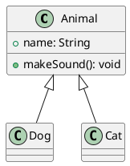
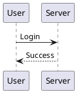

# 🌱 Getting Started with PlantUML

PlantUML is a tool that allows you to generate UML and other types of diagrams from plain text descriptions. It's lightweight, version-controlled, and works well in development environments.

---

## 🛠️ 1. What You Can Create with PlantUML

PlantUML supports:

- ✅ Class Diagrams
- ✅ Sequence Diagrams
- ✅ Use Case Diagrams
- ✅ Activity Diagrams
- ✅ State Diagrams
- ✅ Component Diagrams
- ✅ Deployment Diagrams
- ✅ ER Diagrams (via class/entity syntax)
- ✅ Gantt Charts, Mind Maps, and more

---

## 📦 2. How to Use PlantUML

### Option A: Online Editors

- [PlantUML Online Server](https://www.plantuml.com/plantuml/)
- [PlantText](https://www.planttext.com/)
- [Kroki.io](https://kroki.io/)

### Option B: VS Code + Extension

1. Install **PlantUML** extension in VS Code
2. Install **Java JDK**
3. (Optional) Install **Graphviz** for advanced diagrams
4. Use `Alt+D` to preview your `.puml` diagram

### Option C: Command Line

1. Download [plantuml.jar](https://plantuml.com/download)
2. Run:
   ```bash
   java -jar plantuml.jar diagram.puml
   ```

---

## ✍️ 3. Example Diagrams

### Class Diagram



### Sequence Diagram



---

## 📁 4. Save and Export

- Save files with `.puml` or `.plantuml` extension
- Export as PNG, SVG, or PDF (via VS Code or CLI)

---

## 💡 Tips

- Use `@startuml` and `@enduml` to wrap every diagram
- Indentation is not required but improves readability
- Add comments using `'` (single quote)

---

## 📚 References

- [Official Website](https://plantuml.com/)
- [PlantUML Syntax Guide](https://plantuml.com/guide)
- [Markdown + PlantUML Rendering](https://marketplace.visualstudio.com/items?itemName=jebbs.plantuml)

---

> ✅ With PlantUML, you can create beautiful and maintainable diagrams in plain text — perfect for developers and documentation teams.
