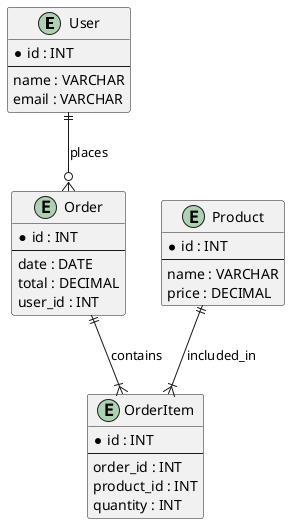

# 🧩 Using PlantUML for ER (Entity-Relationship) Diagrams

PlantUML can be used to design **Entity-Relationship (ER) diagrams** using simple text syntax. This is helpful for documenting database schemas visually and version-controllably.

---

## 📘 1. What is an ER Diagram?

An ER diagram (Entity-Relationship diagram) represents the **entities** (tables), their **attributes** (columns), and **relationships** between them.

---

## 🌿 2. ER Diagram Syntax in PlantUML

PlantUML doesn't have a dedicated ER diagram mode but supports them using **class diagrams with stereotypes** or **entity relationships**.

---

## 🧱 3. Example: Simple ER Diagram

---

## 🔗 4. Relationship Symbols

| Symbol     | Meaning               |
|------------|------------------------|
| `||--||`   | One-to-One             |
| `||--o{`   | One-to-Many (optional) |
| `||--|{`   | One-to-Many (required) |
| `}|--|{`   | Many-to-Many           |

Use meaningful relationship labels like `owns`, `has`, `includes`.

---

## 💡 5. Tips for Better ER Modeling

- Use `*` to mark primary keys
- Use `--` to separate PK from attributes
- Keep naming conventions consistent (snake_case or camelCase)
- Describe foreign keys clearly (e.g., `user_id`, `order_id`)

---

## 🛠️ 6. Tools to Preview

- [PlantUML Online Server](https://www.plantuml.com/plantuml/)
- VS Code with PlantUML extension (`Alt + D` to preview)
- Use `plantuml.jar` for command-line rendering

---

## 📚 References

- [PlantUML Class Diagrams](https://plantuml.com/class-diagram)
- [Entity Relationship Modeling](https://en.wikipedia.org/wiki/Entity–relationship_model)
- [Live PlantUML Editor](https://www.planttext.com/)

---

> ✅ You can now model and visualize relational database designs using PlantUML and integrate them directly into your documentation.
